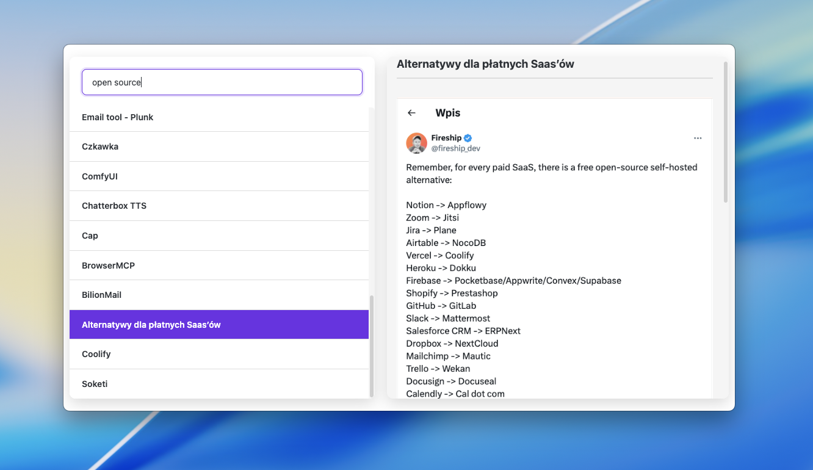
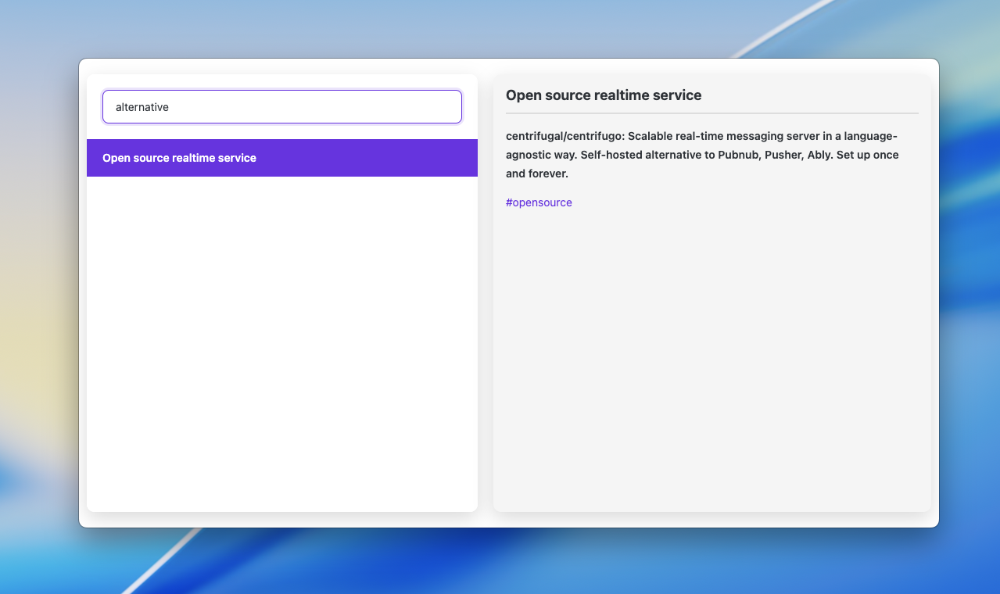

# Obsidian Global Search Plugin

Search your Obsidian notes from anywhere in your system with a global hotkey.

## Features

- **System-wide hotkey**: Access your notes from any application (`Cmd+Shift+O` / `Ctrl+Shift+O`)
- **Fast fuzzy search**: Intelligent matching across note titles and content
- **Live preview**: View note content with rendered markdown including images
- **Recently viewed**: Quick access to recently opened files
- **Multilingual**: Interface available in 18 languages (English, Polish, German, French, Spanish, Italian, Portuguese, Russian, Japanese, Korean, Chinese, Dutch, Turkish, Ukrainian, Czech, Arabic, and more)

## Usage

1. Enable the plugin in Obsidian settings
2. Press the global hotkey from anywhere in your system
3. Type to search through your vault
4. Use arrow keys to navigate, Enter to open selected note

## Configuration

Customize the plugin in Settings → Community plugins → Global Search Hotkey:

- **Language**: Auto-detect or choose from 18 supported languages
- **Global hotkey**: Change the keyboard shortcut (default: `CommandOrControl+Shift+O`)

## Requirements

- Obsidian v0.15.0 or newer
- Desktop only (Windows, macOS, Linux)

## License

MIT
